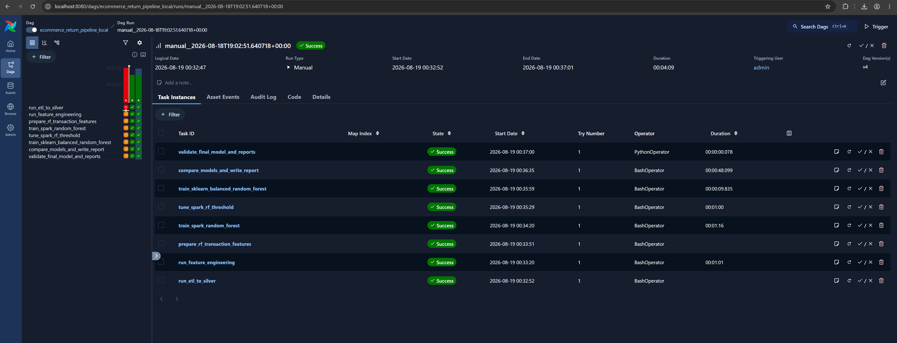
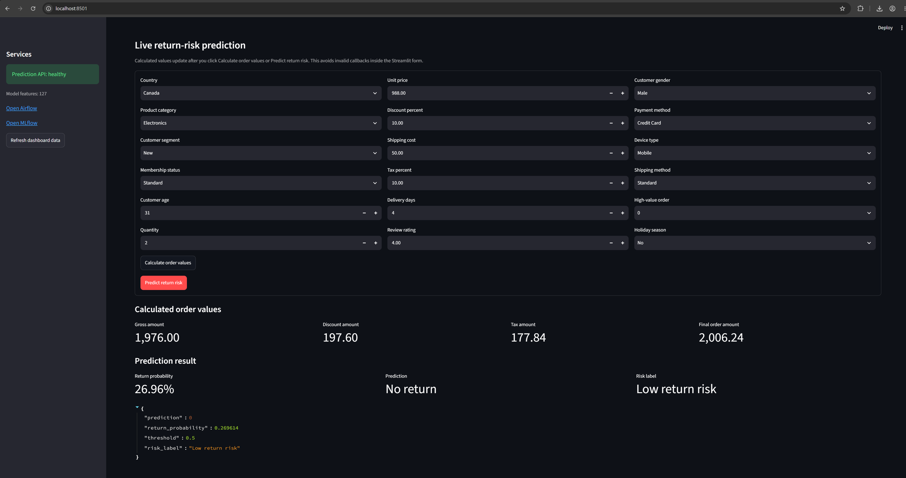
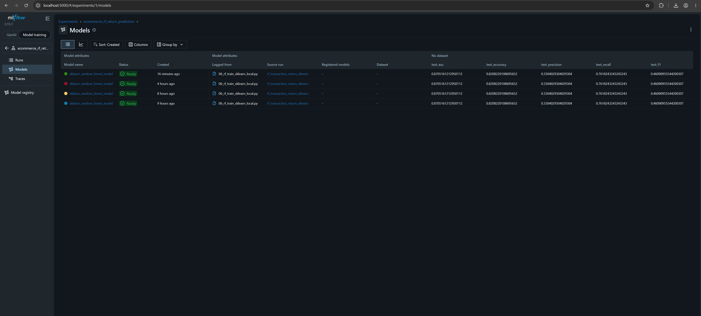
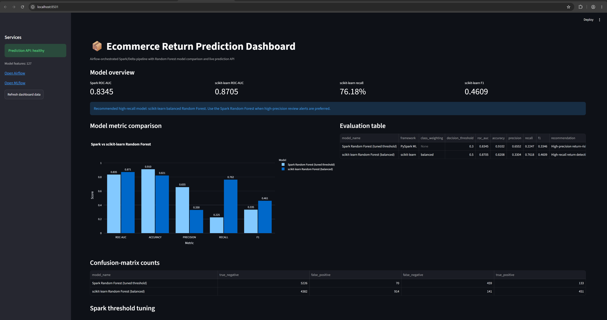

# E-commerce Return Prediction

This module contains the individual return-prediction contribution for the Shopstream e-commerce data platform.

It includes:

- Local ETL and data-cleaning scripts.
- Customer, product, and transaction feature engineering.
- Random Forest model training and comparison.
- Prediction and threshold-tuning workflows.
- A prediction API script.
- An Airflow pipeline definition.
- A Streamlit dashboard.
- Screenshots of successful pipeline and model outputs.

## Project Structure

```text
return-prediction/
├── .gitignore
├── airflow/
│   └── 09_ecommerce_return_pipeline_dag.py
├── dashboard/
│   └── dashboard.py
├── docs/
│   └── images/
│       ├── Airflow-success.png
│       ├── api-prediction.png
│       ├── mlflow-model-results.png
│       └── streamlit-dashboard.png
└── scripts/
    ├── 01_etl_local.py
    ├── 02_feature_engineering_local.py
    ├── 03_rf_feature_prep_local.py
    ├── 04_rf_train_local.py
    ├── 05_rf_predict_tune_local.py
    ├── 06_rf_train_sklearn_local.py
    ├── 07_compare_models_local.py
    └── 08_rf_predict_api_local.py
```

## Pipeline Flow

```text
Raw e-commerce orders
        |
        v
01_etl_local.py
        |
        v
02_feature_engineering_local.py
        |
        v
03_rf_feature_prep_local.py
        |
        v
04_rf_train_local.py
        |
        v
05_rf_predict_tune_local.py
        |
        +--> 06_rf_train_sklearn_local.py
        |
        +--> 07_compare_models_local.py
        |
        v
08_rf_predict_api_local.py
        |
        v
Streamlit dashboard
```

The Airflow DAG provides orchestration for the return-prediction workflow.

## Data and Artifacts

Runtime data and generated artifacts are intentionally excluded from Git:

- Raw CSV files.
- Delta and Parquet output.
- Trained model files.
- MLflow tracking data.
- Local virtual environments.
- Python cache files and logs.

The scripts expect the input data and runtime services to be available in the local project environment.

## Running the Scripts

Run the scripts from the project environment in pipeline order:

```bash
python scripts/01_etl_local.py
python scripts/02_feature_engineering_local.py
python scripts/03_rf_feature_prep_local.py
python scripts/04_rf_train_local.py
python scripts/05_rf_predict_tune_local.py
python scripts/06_rf_train_sklearn_local.py
python scripts/07_compare_models_local.py
python scripts/08_rf_predict_api_local.py
```

The exact input and output locations should be checked in each script before execution.

## Airflow

The DAG is located at:

```text
airflow/09_ecommerce_return_pipeline_dag.py
```

Copy or link the DAG into the configured Airflow DAG directory before starting Airflow. Confirm that the required Python environment, input data, and dependent services are available first.

## Dashboard

The Streamlit application is located at:

```text
dashboard/dashboard.py
```

Start it from the `return-prediction` directory with:

```bash
streamlit run dashboard/dashboard.py
```

The dashboard can be used to inspect return predictions and model-related outputs after the pipeline has produced the required artifacts.

## Screenshots

### Airflow



### API prediction



### MLflow model results



### Streamlit dashboard



## Contribution

This module was developed as an individual contribution to the Shopstream project.

Changes should be made on a separate branch, reviewed, and merged through a pull request. Do not commit raw datasets, generated Delta files, trained model binaries, MLflow databases, or virtual environments.

## Maintainer

Maintainer: Arvind-K9
